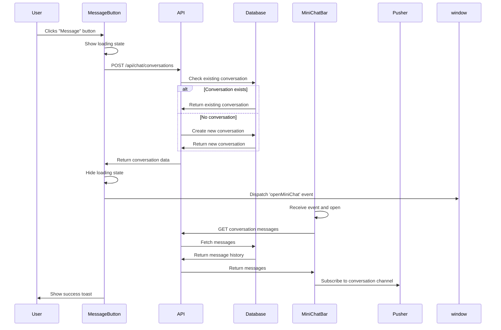
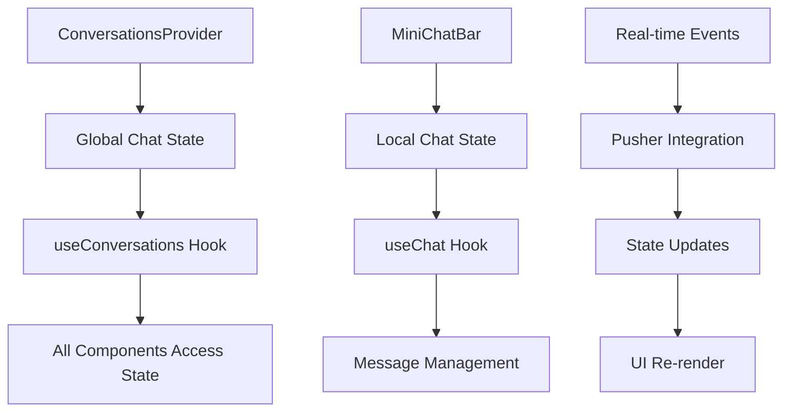
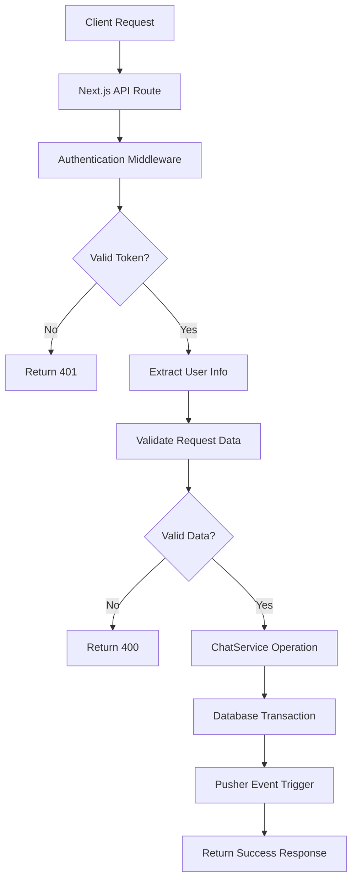
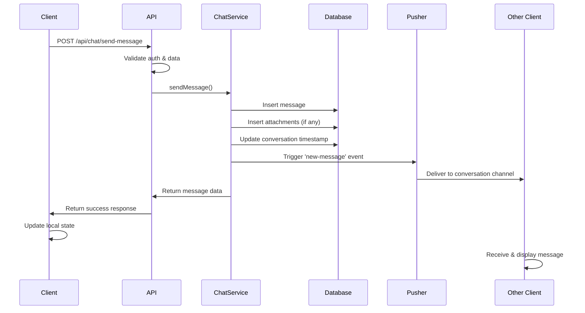
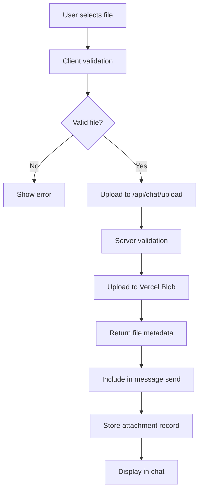
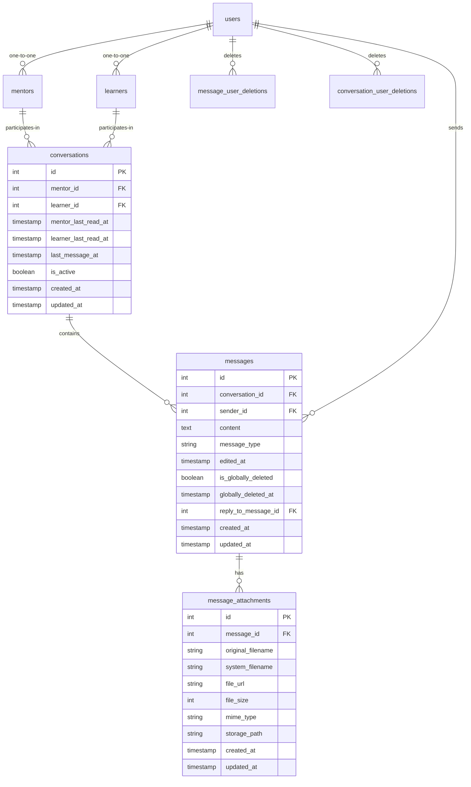
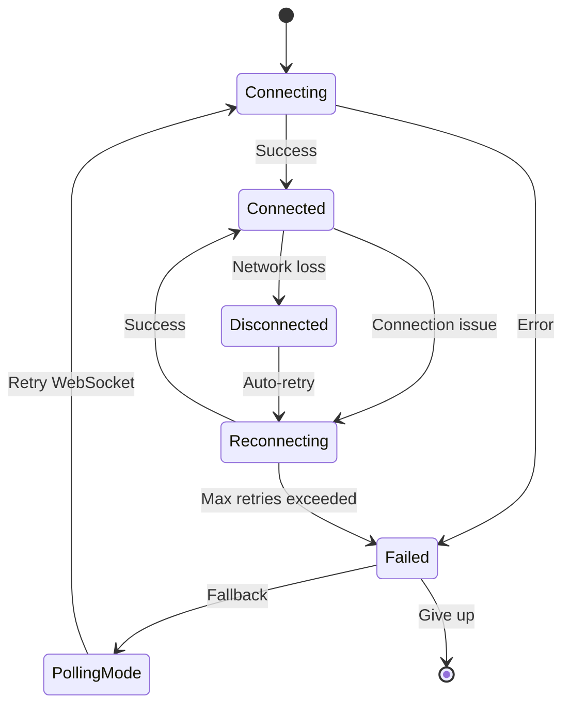
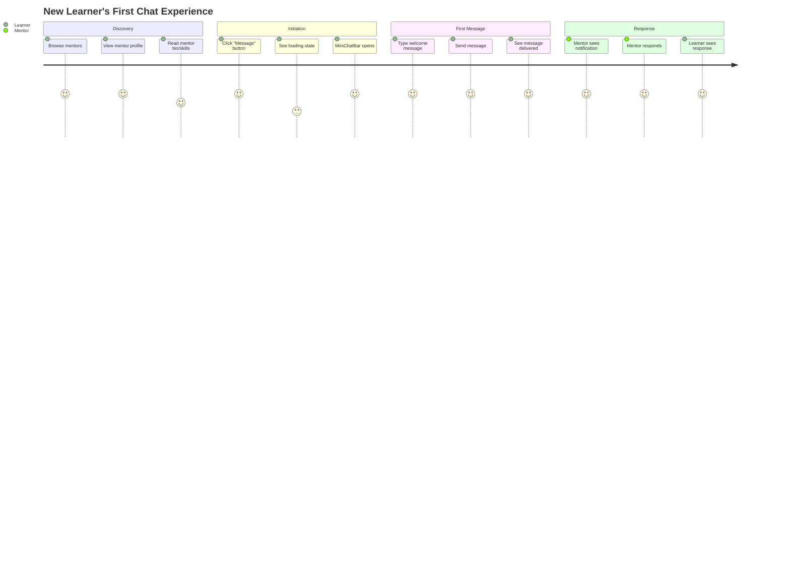
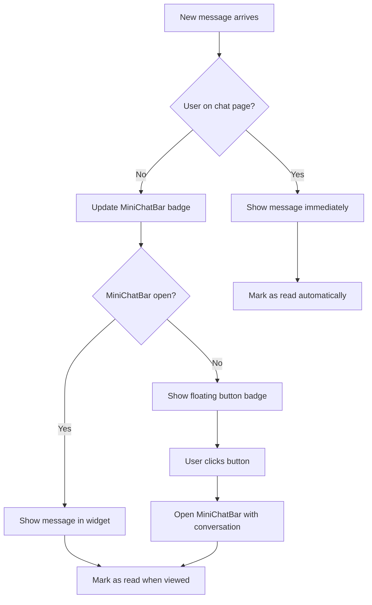

# Chat Feature Comprehensive Documentation

## Overview

This document provides complete technical documentation for the SkillBridge chat feature, including detailed implementation flows, conversation initiation processes, and system architecture.

## Table of Contents

1. [Conversation Initiation Flow](#conversation-initiation-flow)
2. [Component Architecture](#component-architecture)
3. [API Flow Diagrams](#api-flow-diagrams)
4. [Database Design](#database-design)
5. [Real-time Communication](#real-time-communication)
6. [User Experience Flows](#user-experience-flows)
7. [Technical Implementation](#technical-implementation)
8. [Edge Cases and Error Handling](#edge-cases-and-error-handling)

## Conversation Initiation Flow

### Where Conversations Start

#### 1. Primary Entry Points

**A. Mentor Profile Page (`/mentors/[id]/[slug]`)**
```
User Journey:
Learner → Browse Mentors → View Profile → Click "Message" Button

Technical Flow:
ProfilePage → MessageMentorButton → API Call → MiniChatBar Opens
```

**B. Mentor Dashboard Recommended Learners**
```
User Journey:
Mentor → Dashboard → View Recommended Learners → Click "Message" Button

Technical Flow:
DashboardPage → MessageLearnerButton → API Call → MiniChatBar Opens
```

**C. Direct Messages Page Navigation**
```
User Journey:
User → Navigate to /mentor/messages or /learner/messages

Technical Flow:
MessagesPage → ChatLayout → ConversationList → Select/Create Conversation
```

#### 2. Complete Conversation Creation Flow



### 3. Detailed Component Interaction Flow

#### MessageMentorButton Component Flow
```javascript
// Location: components/mentors/MessageMentorButton.tsx

const MessageMentorButton = ({ mentorUserId, mentorName }) => {
  const handleClick = async () => {
    // Step 1: Set loading state
    setLoading(true)

    // Step 2: API call to create/get conversation
    const response = await fetch('/api/chat/conversations', {
      method: 'POST',
      body: JSON.stringify({ mentorUserId })
    })

    // Step 3: Process response
    const { conversation } = await response.json()

    // Step 4: Trigger MiniChatBar opening
    window.dispatchEvent(new CustomEvent('openMiniChat', {
      detail: {
        mentorUserId,
        conversationId: conversation.id,
        conversation: conversation
      }
    }))

    // Step 5: Show success feedback
    toast.success(`Chat with ${mentorName} opened!`)
    setLoading(false)
  }
}
```

#### API Route Processing Flow
```javascript
// Location: app/api/chat/conversations/route.ts

export async function POST(request) {
  // Step 1: Authentication
  const user = await verifyToken(request)

  // Step 2: Extract and validate data
  const { mentorUserId, learnerUserId } = await request.json()

  // Step 3: Determine participant IDs based on user role
  const finalMentorUserId = user.role === 'mentor' ? user.id : mentorUserId
  const finalLearnerUserId = user.role === 'learner' ? user.id : learnerUserId

  // Step 4: Get or create conversation
  const conversation = await ChatService.getOrCreateConversation(
    finalMentorUserId,
    finalLearnerUserId
  )

  // Step 5: Return full conversation data
  return NextResponse.json({ conversation })
}
```

#### ChatService Conversation Logic
```javascript
// Location: lib/services/ChatService.ts

static async getOrCreateConversation(mentorUserId, learnerUserId) {
  // Step 1: Get mentor and learner internal IDs
  const mentor = await db.select({ id: mentors.id })
    .from(mentors)
    .where(eq(mentors.userId, mentorUserId))

  const learner = await db.select({ id: learners.id })
    .from(learners)
    .where(eq(learners.userId, learnerUserId))

  // Step 2: Check for existing conversation
  const existingConversation = await db.select()
    .from(conversations)
    .where(and(
      eq(conversations.mentorId, mentor[0].id),
      eq(conversations.learnerId, learner[0].id)
    ))

  // Step 3: Return existing or create new
  if (existingConversation[0]) {
    return await this.getConversationWithParticipants(existingConversation[0].id)
  } else {
    const newConversation = await db.insert(conversations)
      .values({
        mentorId: mentor[0].id,
        learnerId: learner[0].id,
        isActive: true
      })
      .returning()

    return await this.getConversationWithParticipants(newConversation[0].id)
  }
}
```

## Component Architecture

### 4. Component Hierarchy and Data Flow

```
App Root
├── ClientProviders (ConversationsProvider)
│   ├── MiniChatBar (floating widget)
│   │   ├── ConversationList (when no conversation selected)
│   │   └── ChatInterface (when conversation selected)
│   │       ├── MessageBubble components
│   │       └── MessageInput
│   │
│   ├── Pages
│   │   ├── /mentor/messages → ChatLayout
│   │   ├── /learner/messages → ChatLayout
│   │   ├── /mentors/[id]/[slug] → MessageMentorButton
│   │   └── /mentor/dashboard → MessageLearnerButton
│   │
│   └── ChatLayout (full-page chat)
│       ├── ConversationList (sidebar)
│       └── ChatInterface (main area)
```

### 5. State Management Flow



### 6. Hook Dependencies and Data Flow

```javascript
// useConversations (Global State)
const useConversations = () => {
  const [conversations, setConversations] = useState([])
  const [isConnected, setIsConnected] = useState(false)

  // Fetches all user conversations
  const fetchConversations = async () => {
    const response = await fetch('/api/chat/conversations')
    const data = await response.json()
    setConversations(data.conversations)
  }

  // Real-time subscription management
  const subscribeToConversation = (conversationId) => {
    // Pusher channel subscription
  }

  return {
    conversations,
    fetchConversations,
    subscribeToConversation,
    isConnected
  }
}

// useChat (Conversation-specific State)
const useChat = ({ conversationId, userId }) => {
  const [messages, setMessages] = useState([])
  const [loading, setLoading] = useState(false)

  // Fetches messages for specific conversation
  const fetchMessages = async () => {
    const response = await fetch(`/api/chat/conversations/${conversationId}`)
    const data = await response.json()
    setMessages(data.messages)
  }

  // Sends message to conversation
  const sendMessage = async (content, attachments) => {
    const response = await fetch('/api/chat/send-message', {
      method: 'POST',
      body: JSON.stringify({
        conversationId,
        content,
        attachments
      })
    })
    // Optimistic update + real-time sync
  }

  return {
    messages,
    sendMessage,
    fetchMessages,
    loading
  }
}
```

## API Flow Diagrams

### 7. Complete API Architecture



### 8. Message Sending API Flow



### 9. File Upload Flow



## Database Design

### 10. Entity Relationship Diagram



### 11. Data Access Patterns

```javascript
// Conversation Queries
// 1. Get user conversations with metadata
SELECT c.*, m.user_id as mentor_user_id, l.user_id as learner_user_id,
       last_msg.content as last_message_content,
       COUNT(unread.id) as unread_count
FROM conversations c
JOIN mentors m ON c.mentor_id = m.id
JOIN learners l ON c.learner_id = l.id
LEFT JOIN messages last_msg ON c.id = last_msg.conversation_id
LEFT JOIN messages unread ON c.id = unread.conversation_id
  AND unread.created_at > c.learner_last_read_at
WHERE (m.user_id = ? OR l.user_id = ?)
  AND c.id NOT IN (SELECT conversation_id FROM conversation_user_deletions WHERE user_id = ?)
GROUP BY c.id
ORDER BY c.last_message_at DESC

// Message Queries
// 2. Get conversation messages with pagination
SELECT msg.*, u.first_name, u.last_name,
       COALESCE(m.profile_picture_url, l.profile_picture_url) as profile_picture
FROM messages msg
JOIN users u ON msg.sender_id = u.id
LEFT JOIN mentors m ON u.id = m.user_id
LEFT JOIN learners l ON u.id = l.user_id
WHERE msg.conversation_id = ?
  AND msg.is_globally_deleted = false
  AND msg.id NOT IN (SELECT message_id FROM message_user_deletions WHERE user_id = ?)
ORDER BY msg.created_at DESC
LIMIT ? OFFSET ?
```

## Real-time Communication

### 12. Pusher Integration Architecture

```mermaid
graph TD
    A[Client App] --> B[Pusher Client]
    B --> C[Pusher Service]
    C --> D[Server API]

    D --> E[Trigger Event]
    E --> C
    C --> F[All Subscribed Clients]
    F --> G[Update UI]

    H[Channel Strategy]
    H --> I[conversation-{id}]
    H --> J[user-{id}]
    H --> K[presence-online]
```

### 13. Event Types and Handling

```javascript
// Event Definitions
export const PUSHER_EVENTS = {
  NEW_MESSAGE: 'new-message',
  MESSAGE_DELETED: 'message-deleted',
  MESSAGE_EDITED: 'message-edited',
  TYPING_START: 'typing-start',
  TYPING_STOP: 'typing-stop',
  CONVERSATION_READ: 'conversation-read',
  USER_ONLINE: 'user-online',
  USER_OFFLINE: 'user-offline'
}

// Client Event Handling
const channel = pusher.subscribe(`conversation-${conversationId}`)

channel.bind('new-message', (message) => {
  // Only add if not from current user (avoid duplicates)
  if (message.senderId !== currentUserId) {
    setMessages(prev => [...prev, message])
    // Update conversation list
    updateConversationWithMessage(message)
  }
})

channel.bind('message-deleted', (data) => {
  setMessages(prev => prev.filter(msg => msg.id !== data.messageId))
})

channel.bind('conversation-read', (data) => {
  // Update read receipts in UI
  updateReadStatus(data.conversationId, data.userId, data.readAt)
})
```

### 14. Connection Management and Fallback



## User Experience Flows

### 15. First-Time User Chat Experience



### 16. Cross-Platform Continuity

```
Desktop Experience:
User starts chat on desktop → MiniChatBar or full messages page

Mobile Experience:
User continues on mobile → Responsive MiniChatBar → Same conversation state

Tablet Experience:
User switches to tablet → Adaptive layout → Conversation history synced
```

### 17. Notification and Attention Management



## Technical Implementation

### 18. Component Props and Interface Design

```typescript
// Core Interfaces
interface ConversationWithParticipants {
  id: number
  mentorId: number
  learnerId: number
  mentorLastReadAt: string | null
  learnerLastReadAt: string | null
  lastMessageAt: string | null
  isActive: boolean
  createdAt: string
  updatedAt: string
  mentor: UserProfile
  learner: UserProfile
  lastMessage?: MessagePreview
  unreadCount?: number
}

interface ChatMessage {
  id: number
  conversationId: number
  senderId: number
  content: string
  messageType: 'text' | 'file' | 'image'
  createdAt: string
  editedAt?: string
  sender: UserProfile
  attachments?: FileAttachment[]
}

// Component Props
interface ChatInterfaceProps {
  conversation: ConversationWithParticipants | null
  currentUserId: number
  currentUserName: string
  userRole: 'mentor' | 'learner'
  onMarkAsRead?: (conversationId: number) => void
  className?: string
}

interface MiniChatBarProps {
  user: User | null
  className?: string
}
```

### 19. Error Boundaries and Handling

```javascript
// Chat Error Boundary
class ChatErrorBoundary extends React.Component {
  constructor(props) {
    super(props)
    this.state = { hasError: false, error: null }
  }

  static getDerivedStateFromError(error) {
    return { hasError: true, error }
  }

  componentDidCatch(error, errorInfo) {
    console.error('Chat Error:', error, errorInfo)
    // Log to monitoring service
  }

  render() {
    if (this.state.hasError) {
      return (
        <div className="chat-error-fallback">
          <h3>Chat temporarily unavailable</h3>
          <button onClick={() => window.location.reload()}>
            Reload
          </button>
        </div>
      )
    }

    return this.props.children
  }
}

// API Error Handling
const handleApiError = (error, operation) => {
  console.error(`Chat ${operation} failed:`, error)

  if (error.status === 401) {
    // Redirect to login
    window.location.href = '/login'
  } else if (error.status === 429) {
    toast.error('Too many requests. Please slow down.')
  } else if (error.status >= 500) {
    toast.error('Server error. Please try again later.')
  } else {
    toast.error('Something went wrong. Please try again.')
  }
}
```

### 20. Performance Optimizations

```javascript
// Message Virtualization for Large Conversations
import { FixedSizeList as List } from 'react-window'

const VirtualizedMessageList = ({ messages, height }) => {
  const Row = ({ index, style }) => (
    <div style={style}>
      <MessageBubble message={messages[index]} />
    </div>
  )

  return (
    <List
      height={height}
      itemCount={messages.length}
      itemSize={80}
      overscanCount={5}
    >
      {Row}
    </List>
  )
}

// Optimistic Updates
const optimisticSendMessage = async (content) => {
  const tempId = `temp-${Date.now()}`
  const optimisticMessage = {
    id: tempId,
    content,
    senderId: currentUserId,
    createdAt: new Date().toISOString(),
    status: 'sending'
  }

  // Add immediately to UI
  setMessages(prev => [...prev, optimisticMessage])

  try {
    // Send to server
    const realMessage = await sendMessage(content)

    // Replace optimistic message with real one
    setMessages(prev => prev.map(msg =>
      msg.id === tempId ? realMessage : msg
    ))
  } catch (error) {
    // Mark as failed, allow retry
    setMessages(prev => prev.map(msg =>
      msg.id === tempId ? {...msg, status: 'failed'} : msg
    ))
  }
}
```

## Edge Cases and Error Handling

### 21. Comprehensive Edge Case Matrix

| Scenario | Expected Behavior | Technical Handling |
|----------|------------------|-------------------|
| User deletes conversation, other sends message | Conversation reappears with new message | Check deletion records, create new view |
| Network disconnection during send | Message queued, sent on reconnect | Store in local queue, retry mechanism |
| Simultaneous conversation creation | Only one conversation created | Database unique constraints |
| File upload during network issue | Upload retried automatically | Exponential backoff retry |
| Pusher service unavailable | Graceful fallback to polling | Detection and fallback logic |
| User switches devices mid-conversation | Seamless continuation | Server-side state sync |
| Very long message content | Truncated with "read more" | Client-side text limiting |
| Concurrent message deletions | Consistent state across clients | Real-time event synchronization |
| Browser refresh during chat | State restored from server | Conversation and message refetch |
| File type not supported | Clear error message | MIME type validation |

### 22. Error Recovery Patterns

```javascript
// Automatic Retry with Exponential Backoff
const retryWithBackoff = async (operation, maxRetries = 3) => {
  for (let attempt = 1; attempt <= maxRetries; attempt++) {
    try {
      return await operation()
    } catch (error) {
      if (attempt === maxRetries) throw error

      const delay = Math.min(1000 * Math.pow(2, attempt), 10000)
      await new Promise(resolve => setTimeout(resolve, delay))
    }
  }
}

// Connection Recovery
const handleConnectionLoss = () => {
  setConnectionStatus('disconnected')

  // Try to reconnect
  const reconnectInterval = setInterval(async () => {
    try {
      await testConnection()
      setConnectionStatus('connected')
      clearInterval(reconnectInterval)

      // Resync messages
      await syncMissedMessages()
    } catch (error) {
      console.log('Reconnection failed, retrying...')
    }
  }, 5000)
}

// Data Sync Recovery
const syncMissedMessages = async () => {
  const lastMessageTime = messages[messages.length - 1]?.createdAt

  if (lastMessageTime) {
    const missedMessages = await fetchMessagesSince(conversationId, lastMessageTime)
    setMessages(prev => [...prev, ...missedMessages])
  }
}
```

This comprehensive documentation provides detailed flows showing exactly how conversations are initiated, where they start, and how all components work together to create the complete chat experience. The technical flows and diagrams make it clear how data moves through the system and how different components interact.