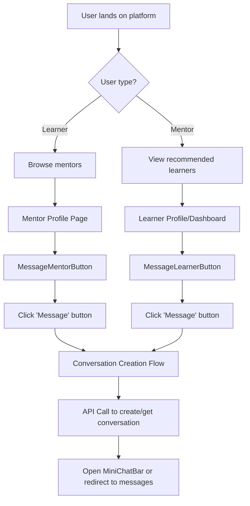
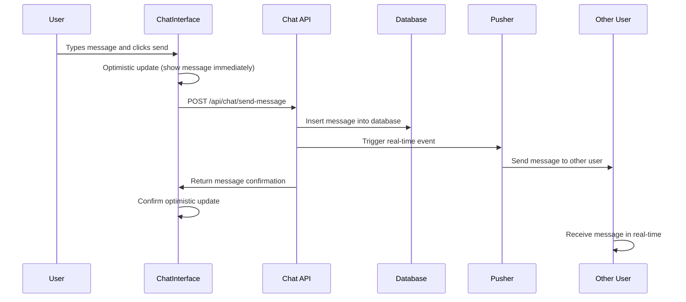
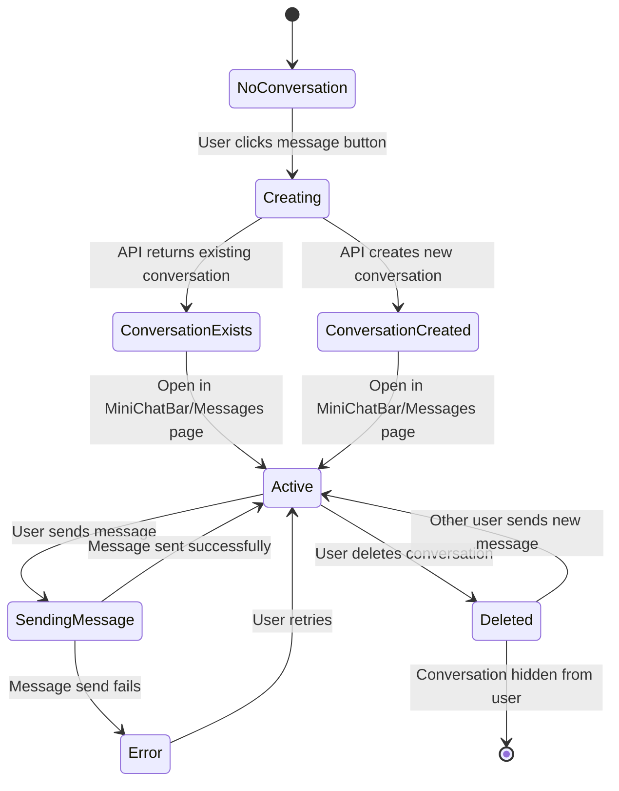
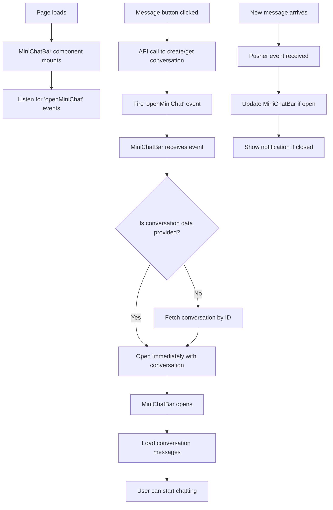
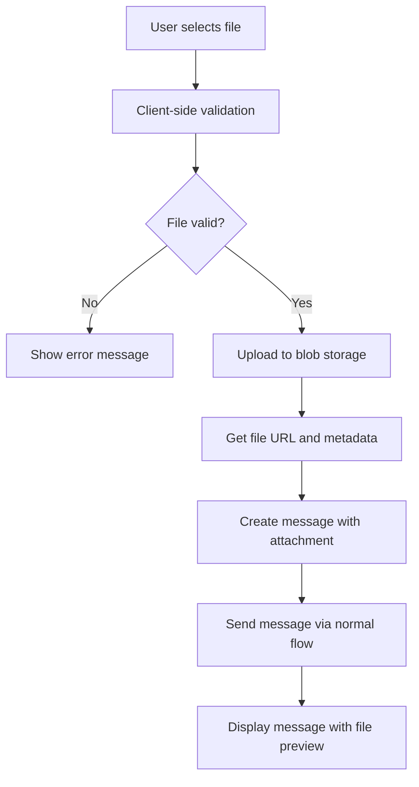
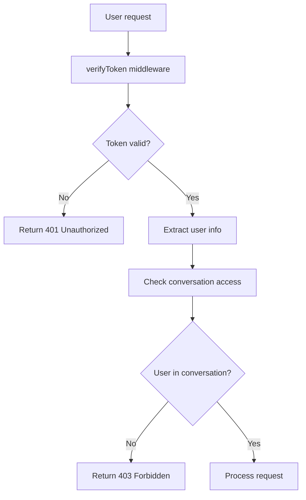
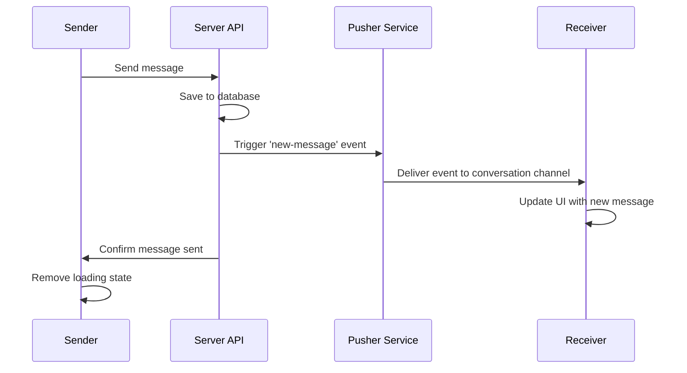
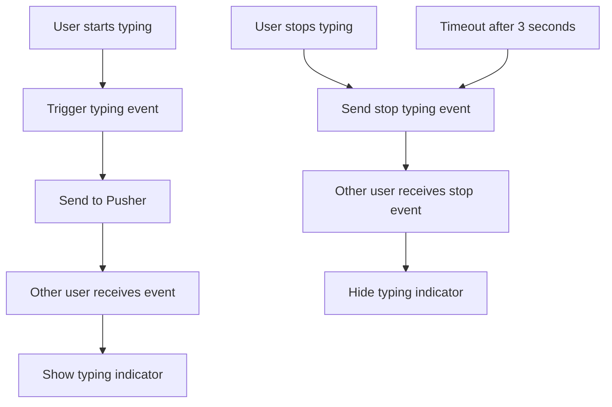

# SkillBridge Chat System Documentation

## Table of Contents
1. [Overview](#overview)
2. [System Architecture](#system-architecture)
3. [Conversation Flow](#conversation-flow)
4. [Technical Implementation](#technical-implementation)
5. [Data Flow Diagrams](#data-flow-diagrams)
6. [User Journey Flows](#user-journey-flows)
7. [API Integration Flows](#api-integration-flows)
8. [Real-time Communication Flow](#real-time-communication-flow)
9. [Error Handling Flows](#error-handling-flows)
10. [Development Guide](#development-guide)

## Overview

The SkillBridge chat system enables real-time communication between mentors and learners within the platform. It provides a comprehensive messaging solution with file sharing, conversation management, and read receipts, designed to facilitate meaningful interactions in the mentorship context.

### Key Components
- **Conversation Management**: Private 1:1 conversations between mentor-learner pairs
- **Real-time Messaging**: Instant message delivery with Pusher WebSockets
- **File Sharing**: Upload and share documents, images, and other files
- **Message Management**: Delete, edit, and reply to messages
- **Read Receipts**: Track message delivery and read status
- **Cross-platform Access**: MiniChatBar widget and dedicated message pages

## System Architecture

### High-Level Architecture
```
┌─────────────────┐    ┌──────────────────┐    ┌─────────────────┐
│   Frontend      │    │   Backend APIs   │    │   Database      │
│                 │    │                  │    │                 │
│ • ChatInterface │◄──►│ • Chat Routes    │◄──►│ • conversations │
│ • MiniChatBar   │    │ • File Upload    │    │ • messages      │
│ • MessageInput  │    │ • WebSocket Hub  │    │ • attachments   │
│ • ConversationList    │ • Auth Layer     │    │ • deletions     │
└─────────────────┘    └──────────────────┘    └─────────────────┘
         │                       │                       │
         └───────────────────────┼───────────────────────┘
                                 │
                    ┌──────────────────┐
                    │ Real-time Layer  │
                    │                  │
                    │ • Pusher Events  │
                    │ • Typing Status  │
                    │ • Read Receipts  │
                    └──────────────────┘
```

### Core Components

#### Database Layer
- **conversations**: Stores conversation metadata between mentor-learner pairs
- **messages**: Individual messages with content, type, and status
- **message_attachments**: File uploads linked to messages
- **message_user_deletions**: Per-user message deletion tracking
- **conversation_user_deletions**: Per-user conversation deletion tracking

#### API Layer
- **Chat Routes**: CRUD operations for conversations and messages
- **File Upload**: Secure file handling with validation
- **Authentication**: Session-based access control
- **Real-time Events**: Pusher event triggering

#### Frontend Layer
- **ChatInterface**: Main chat UI component
- **MiniChatBar**: Floating chat widget
- **MessageInput**: Message composition with file upload
- **ConversationList**: List of user conversations

## Conversation Flow

### How Conversations Get Started

#### 1. Entry Points for Starting Conversations



#### 2. Detailed Conversation Startup Process

**Step 1: User Interaction**
```javascript
// Location: components/mentors/MessageMentorButton.tsx
// or components/learners/MessageLearnerButton.tsx

const handleClick = async () => {
  // 1. User clicks message button on profile/dashboard
  // 2. Button shows loading state
  // 3. API call initiated
}
```

**Step 2: API Processing**
```javascript
// Location: app/api/chat/conversations/route.ts

POST /api/chat/conversations
{
  mentorUserId?: number,  // If initiated by learner
  learnerUserId?: number  // If initiated by mentor
}

// API determines user role and creates conversation
```

**Step 3: Conversation Creation Logic**
```javascript
// Location: lib/services/ChatService.ts

static async getOrCreateConversation(mentorUserId, learnerUserId) {
  // 1. Check if conversation already exists
  // 2. If exists: return existing conversation
  // 3. If not: create new conversation
  // 4. Return conversation with full participant data
}
```

**Step 4: UI Response**
```javascript
// Back in MessageButton component

// 1. Receive conversation data from API
// 2. Trigger custom event to open MiniChatBar
window.dispatchEvent(new CustomEvent('openMiniChat', {
  detail: { conversationId, conversation }
}))

// 3. Show success toast
// 4. MiniChatBar automatically opens
```

### 3. Conversation Flow Across Different Contexts

#### From Mentor Profile Page
```
Learner visits mentor profile
         ↓
Clicks "Message" button
         ↓
MessageMentorButton.handleClick()
         ↓
API: POST /api/chat/conversations
Body: { mentorUserId }
         ↓
ChatService.getOrCreateConversation()
         ↓
Returns existing or new conversation
         ↓
Custom event 'openMiniChat' fired
         ↓
MiniChatBar opens with conversation
         ↓
Learner can start messaging
```

#### From Mentor Dashboard (Recommended Learners)
```
Mentor views dashboard
         ↓
Sees recommended learners
         ↓
Clicks "Message" on learner card
         ↓
MessageLearnerButton.handleClick()
         ↓
API: POST /api/chat/conversations
Body: { learnerUserId }
         ↓
ChatService.getOrCreateConversation()
         ↓
MiniChatBar opens with conversation
         ↓
Mentor can start messaging
```

#### From Direct Navigation to Messages Page
```
User navigates to /mentor/messages or /learner/messages
         ↓
ChatLayout component loads
         ↓
useConversations hook fetches all conversations
         ↓
ConversationList displays existing conversations
         ↓
User can select conversation or start new one
```

## Technical Implementation

### 4. Complete Data Flow for Message Sending



### 5. Conversation State Management Flow



### 6. MiniChatBar Integration Flow



## Data Flow Diagrams

### 7. Complete Message Lifecycle

```
Message Creation:
User Input → Validation → Optimistic UI Update → API Call → Database Insert → Pusher Event → Real-time Delivery

Message Display:
Database Query → Message List → UI Rendering → Attachment Loading → Read Status Update

Message Deletion:
User Action → Confirmation → API Call → Database Update → UI Update → Pusher Event → Other User UI Update
```

### 8. File Upload Flow



## User Journey Flows

### 9. New User First Message Flow

```
1. Learner signs up and browses mentors
2. Finds suitable mentor profile
3. Clicks "Message" button on mentor profile
4. System creates first conversation automatically
5. MiniChatBar opens with empty conversation
6. Learner types first message
7. Message sent and delivered to mentor in real-time
8. Mentor receives notification (if implemented)
9. Mentor can respond via MiniChatBar or messages page
10. Conversation continues...
```

### 10. Returning User Flow

```
1. User logs in
2. MiniChatBar loads with unread message count
3. User sees notification badge on floating chat button
4. Clicks to open MiniChatBar
5. Sees list of recent conversations
6. Clicks on conversation with unread messages
7. Conversation opens, messages marked as read
8. User can continue existing conversation
```

### 11. Cross-Device Continuation Flow

```
1. User starts conversation on desktop
2. Logs in on mobile device
3. MiniChatBar/Messages page loads conversation history
4. Real-time sync ensures message continuity
5. User can continue conversation seamlessly
6. Read receipts sync across devices
```

## API Integration Flows

### 12. Authentication Flow Integration



### 13. Rate Limiting Flow

```
Request → Rate Limit Check → Allow/Deny → API Processing
   ↓
If denied: Return 429 Too Many Requests
If allowed: Continue to business logic
```

### 14. Error Handling Flow

```mermaid
graph TD
    A[API Request] --> B[Try processing]
    B --> C{Success?}
    C -->|Yes| D[Return success response]
    C -->|No| E[Catch error]
    E --> F{Error type?}
    F -->|Validation| G[Return 400 Bad Request]
    F -->|Auth| H[Return 401/403]
    F -->|Not Found| I[Return 404]
    F -->|Server| J[Log error & return 500]

    G --> K[Client shows user-friendly message]
    H --> L[Redirect to login]
    I --> M[Show "not found" message]
    J --> N[Show "try again" message]
```

## Real-time Communication Flow

### 15. Pusher Event Flow



### 16. Connection Management Flow

```
App Load → Initialize Pusher → Subscribe to User Channels → Listen for Events

Connection Lost → Show Offline Status → Attempt Reconnection → Resync on Reconnect

Connection Restored → Update Online Status → Resubscribe to Channels → Sync Missed Events
```

### 17. Typing Indicator Flow



## Error Handling Flows

### 18. Network Error Recovery

```
Message Send Fails → Show Retry Button → User Clicks Retry → Attempt Resend → Success/Fail

Connection Lost → Queue Messages → Show Offline Status → Reconnect → Send Queued Messages
```

### 19. Validation Error Flow

```
User Input → Client Validation → Server Validation → Database Constraints
     ↓              ↓                ↓                    ↓
Show inline    Return 400      Return specific      Database error
error         bad request      error message        handling
```

## Development Guide

### 20. Adding New Message Types

```javascript
// 1. Update database schema
export const messages = pgTable("messages", {
  messageType: varchar("message_type", { length: 20 }).default("text"),
  // Add new types: "text", "file", "image", "voice", "video"
})

// 2. Update API validation
const sendMessageSchema = z.object({
  messageType: z.enum(['text', 'file', 'image', 'voice', 'video']).default('text'),
})

// 3. Update UI components
const MessageBubble = ({ message }) => {
  switch (message.messageType) {
    case 'voice': return <VoiceMessageComponent />
    case 'video': return <VideoMessageComponent />
    // ... etc
  }
}
```

### 21. Adding New Real-time Events

```javascript
// 1. Define event in pusher config
export const PUSHER_EVENTS = {
  NEW_MESSAGE: 'new-message',
  MESSAGE_EDITED: 'message-edited',  // New event
  USER_STARTED_CALL: 'user-started-call'  // New event
}

// 2. Trigger event in API
await triggerPusherEvent(
  getConversationChannel(conversationId),
  PUSHER_EVENTS.MESSAGE_EDITED,
  { messageId, newContent }
)

// 3. Listen in client
channel.bind(PUSHER_EVENTS.MESSAGE_EDITED, (data) => {
  updateMessageInUI(data.messageId, data.newContent)
})
```

### 22. Conversation Creation Customization

```javascript
// To customize conversation creation behavior:

// 1. Modify ChatService.getOrCreateConversation()
// 2. Add custom fields to conversation schema
// 3. Update ConversationWithParticipants interface
// 4. Modify API route validation
// 5. Update UI components to handle new fields
```

This comprehensive documentation shows exactly how conversations are started, where they originate from, and how the entire chat system flows together. The flow diagrams and step-by-step processes make it clear how each component interacts with others to create a seamless chat experience.