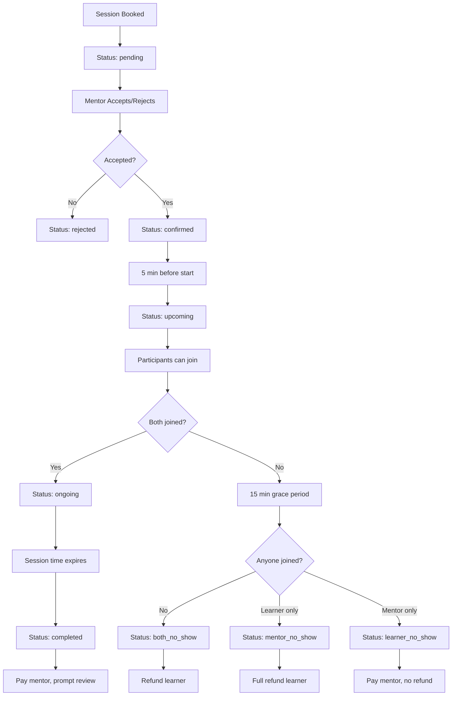

# Complete Session Management & Video Call System Documentation

## Table of Contents
1. [System Overview](#system-overview)
2. [Session Lifecycle](#session-lifecycle)
3. [1-on-1 Video Session Requirements](#1-on-1-video-session-requirements)
4. [Session Status Management](#session-status-management)
5. [No-Show Detection System](#no-show-detection-system)
6. [Session Monitoring & Updates](#session-monitoring--updates)
7. [Edge Cases & Error Handling](#edge-cases--error-handling)
8. [Database Schema & Fields](#database-schema--fields)
9. [API Endpoints](#api-endpoints)
10. [Client-Side Components](#client-side-components)
11. [Troubleshooting Guide](#troubleshooting-guide)

---

## System Overview

The session management system handles the complete lifecycle of 1-on-1 mentoring sessions, from booking to completion. It consists of three main components:

1. **Server-Side Monitoring** (`SessionMonitorService`) - Runs every 2 minutes to detect no-shows, complete sessions, and handle edge cases
2. **Client-Side Tracking** (`SimpleSessionTracker`) - Real-time session state management and automatic disconnection
3. **Real-Time Updates** (`SSE + useSessionUpdates`) - Instant communication between server and clients

---

## Session Lifecycle

### Complete Flow Diagram


### Status Transitions

| From Status | To Status | Trigger | Action Required |
|------------|-----------|---------|-----------------|
| `pending` | `confirmed` | Mentor accepts | None |
| `pending` | `rejected` | Mentor rejects | Refund learner |
| `confirmed` | `upcoming` | 5 min before start | Enable join functionality |
| `upcoming` | `ongoing` | Both participants join | Start video call |
| `ongoing` | `completed` | Session time expires | Pay mentor, prompt review |
| `confirmed/upcoming` | `both_no_show` | 15 min after start, no joins | Refund learner |
| `confirmed/upcoming` | `mentor_no_show` | 15 min after start, learner only | Full refund learner |
| `confirmed/upcoming` | `learner_no_show` | 15 min after start, mentor only | Pay mentor |

---

## 1-on-1 Video Session Requirements

### Core Requirements

1. **Exclusive Participation**
   - Only the specific booked mentor and learner can join
   - No unauthorized users allowed
   - Maximum 2 participants total (mentor + learner)

2. **Session Isolation**
   - Each session has unique Agora channel
   - No cross-session contamination
   - Secure access control per session

3. **Duplicate Connection Prevention**
   - One connection per participant maximum
   - Block multiple browser/device connections
   - Clear existing connections before new ones

### Access Control Matrix

| User Type | Can Join? | Conditions |
|-----------|-----------|------------|
| Booked Learner | ✅ Yes | Session status: confirmed/upcoming/ongoing |
| Booked Mentor | ✅ Yes | Session status: confirmed/upcoming/ongoing |
| Different Learner | ❌ No | Always blocked |
| Different Mentor | ❌ No | Always blocked |
| Admin | ⚠️ Special | Force disconnect capability only |

### Connection Validation Process

```typescript
// 1. Verify user identity
const isAuthorizedUser = (userId === bookedLearner.userId || userId === bookedMentor.userId)

// 2. Check session status
const validStatuses = ['confirmed', 'upcoming', 'ongoing']
const canJoin = validStatuses.includes(session.status)

// 3. Verify no existing connection
const hasActiveConnection = (userRole === 'learner' ? 
  session.learnerJoinedAt && !session.learnerLeftAt : 
  session.mentorJoinedAt && !session.mentorLeftAt)

// 4. Check participant count in Agora
const participantCount = agoraChannel.participants.length
const roomFull = participantCount >= 2

// Final decision
const allowJoin = isAuthorizedUser && canJoin && !hasActiveConnection && !roomFull
```

---

## Session Status Management

### Status Definitions

| Status | Description | Duration | Financial Impact |
|--------|-------------|----------|------------------|
| `pending` | Awaiting mentor response | Up to 24 hours | Learner credits in escrow |
| `confirmed` | Mentor accepted, session scheduled | Until 5 min before start | Learner charged, mentor payment pending |
| `upcoming` | Session starts soon, can join waiting room | 5 min before start | Ready for video call |
| `ongoing` | Video session active | During session duration | Active session monitoring |
| `completed` | Session finished successfully | Permanent | Mentor paid, review prompted |
| `both_no_show` | Neither participant joined | Permanent | Full refund to learner |
| `mentor_no_show` | Mentor didn't join within grace period | Permanent | Full refund to learner |
| `learner_no_show` | Learner didn't join within grace period | Permanent | Mentor compensated |
| `cancelled` | Manually cancelled before start | Permanent | Refund based on timing |
| `rejected` | Mentor declined session | Permanent | Full refund to learner |

### Status Update Triggers

#### Automatic Triggers (Server-Side)
- **Every 2 minutes**: `SessionMonitorService` checks for status updates
- **5 minutes before start**: `confirmed` → `upcoming`
- **15 minutes after start**: No-show detection
- **At session end time**: `ongoing` → `completed`

#### Manual Triggers (User Actions)
- **Mentor accepts**: `pending` → `confirmed`
- **Mentor rejects**: `pending` → `rejected`
- **User cancels**: Any → `cancelled`
- **Both join**: `upcoming` → `ongoing`
- **Admin intervention**: Any → `cancelled`

---

## No-Show Detection System

### Grace Period Rules

1. **15-minute grace period** starts from `session.startTime` (not scheduledDate)
2. **Participation tracked** by `learnerJoinedAt` and `mentorJoinedAt` timestamps
3. **No-show detected** 15 minutes after start time if participation requirements not met

### No-Show Types & Actions

#### Both No-Show (`both_no_show`)
**Condition**: Neither learner nor mentor joined within 15 minutes
```typescript
const bothNoShow = !session.learnerJoinedAt && !session.mentorJoinedAt
```
**Actions**:
- Refund full amount to learner
- No mentor payment
- Session marked as `both_no_show`
- Both participants removed from video room
- Notification to both parties

#### Mentor No-Show (`mentor_no_show`)
**Condition**: Learner joined, mentor didn't within 15 minutes
```typescript
const mentorNoShow = session.learnerJoinedAt && !session.mentorJoinedAt
```
**Actions**:
- Full refund to learner (100% of session cost)
- No mentor payment
- Session marked as `mentor_no_show`
- Participants removed from video room
- Learner compensated for time wasted
- Mentor penalized (potential account restriction)

#### Learner No-Show (`learner_no_show`)
**Condition**: Mentor joined, learner didn't within 15 minutes
```typescript
const learnerNoShow = !session.learnerJoinedAt && session.mentorJoinedAt
```
**Actions**:
- No refund to learner
- Mentor receives full payment (as compensation for time)
- Session marked as `learner_no_show`
- Participants removed from video room
- Mentor compensated for showing up

### No-Show Detection Algorithm

```typescript
// Runs every 2 minutes in SessionMonitorService
async function detectNoShows() {
  const now = new Date()
  
  // Find sessions past grace period
  const potentialNoShows = await db.select()
    .from(bookingSessions)
    .where(
      and(
        or(eq(status, 'confirmed'), eq(status, 'upcoming')),
        lt(sql`${startTime} + INTERVAL '15 minutes'`, now)
      )
    )
  
  for (const session of potentialNoShows) {
    const noShowType = determineNoShowType(session)
    if (noShowType) {
      await processNoShow(session, noShowType)
    }
  }
}
```

---

## Session Monitoring & Updates

### Server-Side Monitoring (`SessionMonitorService`)

#### Monitoring Schedule
- **Interval**: Every 2 minutes
- **Startup**: Automatic initialization on server start
- **Recovery**: Catches up on missed sessions if server was down

#### Monitoring Tasks (in order)

1. **Process Expired Bookings**
   - Mark sessions past 24-hour response window as expired
   - Refund learners for unaccepted bookings

2. **Update to Upcoming Status**
   - Mark sessions as `upcoming` 5 minutes before start
   - Enable waiting room functionality

3. **Detect No-Shows**
   - Check sessions 15+ minutes past start time
   - Process refunds/payments based on no-show type

4. **Complete Sessions at End Time**
   - Mark ongoing sessions as `completed` when `endTime` reached
   - Process mentor payments
   - Trigger review prompts for learners

5. **Handle Stuck Sessions**
   - Fix sessions stuck in `upcoming` status
   - Reset or advance status as appropriate

### Client-Side Tracking (`SimpleSessionTracker`)

#### Real-Time State Management
```typescript
interface SessionState {
  id: number
  status: string
  startTime: Date
  endTime: Date
  learnerJoined: boolean
  mentorJoined: boolean
  isActive: boolean
  timeRemaining: number
}
```

#### Automatic Actions
- **Session End Timer**: Automatically ends session when `timeRemaining` reaches 0
- **State Synchronization**: Updates local state based on server events
- **Resource Cleanup**: Cleans up timers and resources on session end

### Real-Time Updates (`SSE System`)

#### Update Types
| Update Type | Triggered By | Client Action |
|-------------|--------------|---------------|
| `force_disconnect` | No-show detection | Immediate disconnect |
| `session_terminated` | Time expiration | Show completion, disconnect |
| `admin_force_disconnect` | Admin action | Immediate disconnect |
| `status_change` | Any status update | Update UI, handle accordingly |
| `participant_joined` | User joins | Update participant count |
| `participant_left` | User leaves | Update participant count |

#### SSE Connection Management
- **Auto-reconnection**: Up to 5 retry attempts
- **Heartbeat**: Every 30 seconds to maintain connection
- **Cleanup**: Automatic cleanup of stale connections

---

## Edge Cases & Error Handling

### Network & Connection Issues

#### Scenario: User loses internet during session
**Detection**: Connection state changes, reconnection attempts
**Handling**:
1. Client attempts automatic reconnection (up to 3 tries)
2. Show "reconnecting" status to user
3. If reconnection fails, mark as technical issues
4. Process appropriate refund/compensation

#### Scenario: Server goes down during active session
**Detection**: SSE connection lost, monitoring service stopped
**Handling**:
1. Clients continue video call via Agora (P2P connection)
2. When server recovers, catch up on missed monitoring
3. Process any sessions that should have ended
4. Send delayed notifications

### Session Timing Edge Cases

#### Scenario: User joins exactly at 15-minute mark
**Issue**: Race condition between client join and server no-show detection
**Handling**:
1. Client join takes precedence if timestamp is close
2. Server rechecks after processing join
3. No-show only processed if no recent join activity

#### Scenario: Session extended beyond scheduled time
**Current Behavior**: Auto-complete at scheduled end time
**Handling**:
1. Show "time expired" warning
2. Allow 5-minute grace period for natural conclusion
3. Force completion after grace period

### Participant Management Edge Cases

#### Scenario: Same user joins from multiple devices
**Detection**: Multiple join attempts with same user ID
**Handling**:
1. Block second connection attempt
2. Show "already connected" error
3. Provide option to force disconnect other session

#### Scenario: User never leaves call properly
**Detection**: `learnerJoinedAt` set but no `learnerLeftAt`
**Handling**:
1. Agora channel timeout handles actual disconnection
2. Periodic cleanup marks stale connections as left
3. No impact on session completion

### Payment & Refund Edge Cases

#### Scenario: Payment processing fails during completion
**Handling**:
1. Mark session as completed
2. Queue payment for retry
3. Send notification once payment processes
4. Log failure for manual review

#### Scenario: User requests refund after no-show
**Policy**: No-show decisions are automated and final
**Handling**:
1. Direct user to support for exceptional cases
2. Manual review for technical failures only
3. Account notes for pattern analysis

### Agora Video Service Edge Cases

#### Scenario: Agora service is down
**Detection**: Connection failures, token generation errors
**Handling**:
1. Show technical difficulties message
2. Automatically reschedule session
3. Full refund to learner
4. Notify both parties

#### Scenario: Poor video quality throughout session
**Detection**: Network quality monitoring in client
**Handling**:
1. Show quality warnings to users
2. Suggest troubleshooting steps
3. If severe, offer technical issues completion
4. Process refund if both parties agree

---

## Database Schema & Fields

### `booking_sessions` Table

#### Core Session Fields
```sql
id: SERIAL PRIMARY KEY
learnerId: INTEGER (FK to learners.id)
mentorId: INTEGER (FK to mentors.id)
mentorSkillId: INTEGER (FK to mentor_skills.id)
status: VARCHAR(20) -- Session status
```

#### Timing Fields
```sql
scheduledDate: TIMESTAMP WITH TIME ZONE -- Original booking time
startTime: TIMESTAMP WITH TIME ZONE -- Actual session start
endTime: TIMESTAMP WITH TIME ZONE -- Actual session end
durationMinutes: INTEGER -- Session duration
expiresAt: TIMESTAMP WITH TIME ZONE -- Booking expiration
```

#### Participation Tracking
```sql
learnerJoinedAt: TIMESTAMP WITH TIME ZONE
mentorJoinedAt: TIMESTAMP WITH TIME ZONE
learnerLeftAt: TIMESTAMP WITH TIME ZONE
mentorLeftAt: TIMESTAMP WITH TIME ZONE
learnerConnectionDurationMs: INTEGER
mentorConnectionDurationMs: INTEGER
```

#### Video Call Fields
```sql
agoraChannelName: VARCHAR(255) -- Unique channel identifier
agoraChannelCreatedAt: TIMESTAMP WITH TIME ZONE
agoraCallStartedAt: TIMESTAMP WITH TIME ZONE
agoraCallEndedAt: TIMESTAMP WITH TIME ZONE
agoraRecordingId: VARCHAR(255) -- For future recording feature
agoraRecordingUrl: VARCHAR(512)
```

#### Financial Fields
```sql
totalCostCredits: INTEGER -- Total session cost
escrowCredits: INTEGER -- Amount in escrow
refundAmount: INTEGER -- Amount refunded (if any)
refundProcessedAt: TIMESTAMP WITH TIME ZONE
penaltyAmount: INTEGER -- Penalty fees (if any)
```

#### Metadata Fields
```sql
sessionNotes: TEXT -- Learner's session notes
cancellationReason: TEXT -- Reason for cancellation
mentorResponseAt: TIMESTAMP WITH TIME ZONE
mentorResponseMessage: TEXT
rejectionReason: TEXT
noShowCheckedAt: TIMESTAMP WITH TIME ZONE
createdAt: TIMESTAMP WITH TIME ZONE
updatedAt: TIMESTAMP WITH TIME ZONE
```

### Key Indexes

```sql
-- Session monitoring queries
CREATE INDEX idx_sessions_monitoring ON booking_sessions(status, startTime, endTime);

-- No-show detection
CREATE INDEX idx_sessions_noshow ON booking_sessions(status, startTime, learnerJoinedAt, mentorJoinedAt);

-- User session lookup
CREATE INDEX idx_sessions_learner ON booking_sessions(learnerId, status);
CREATE INDEX idx_sessions_mentor ON booking_sessions(mentorId, status);

-- Agora channel management
CREATE INDEX idx_sessions_agora ON booking_sessions(agoraChannelName, agoraCallEndedAt);
```

---

## API Endpoints

### Session Management Endpoints

#### `GET /api/sessions/[id]/join`
**Purpose**: Check if user can join session
**Returns**: Session details and access permissions
```typescript
Response: {
  success: boolean
  sessionDetails: SessionDetails
  userRole: 'mentor' | 'learner'
  canJoin: boolean
  isWithinMeetingTime: boolean
}
```

#### `POST /api/sessions/[id]/join`
**Purpose**: Track user joining session
**Updates**: `learnerJoinedAt` or `mentorJoinedAt`
**Side Effects**: May update status to `ongoing`

#### `POST /api/sessions/[id]/leave`
**Purpose**: Track user leaving session
**Updates**: `learnerLeftAt` or `mentorLeftAt`
**Side Effects**: May end Agora channel if last participant

#### `POST /api/sessions/[id]/complete`
**Purpose**: Mark session as completed
**Accepts**: `endType` parameter for completion reason
**Side Effects**: Process payments, send notifications

### Admin Endpoints

#### `POST /api/admin/force-disconnect/[sessionId]`
**Purpose**: Forcibly end session and remove all participants
**Authorization**: Admin only
**Actions**: End Agora channel, broadcast disconnect signal

#### `GET /api/admin/session-monitor`
**Purpose**: Get session monitoring service status
**Returns**: Service health, last run time, statistics

### Agora Integration Endpoints

#### `POST /api/agora/token`
**Purpose**: Generate Agora access token for session
**Validation**: User access permissions
**Returns**: Token, channel name, user ID

### Real-Time Update Endpoints

#### `GET /api/sse/session-updates`
**Purpose**: Establish SSE connection for real-time updates
**Authentication**: Required
**Streams**: Session status changes, force disconnect signals

---

## Client-Side Components

### Component Hierarchy

```
VideoCallMain.tsx (Legacy - Complex)
├── ConnectionStatus
├── VideoDisplay
├── VideoControls
├── ChatPanel
├── SessionRatingModal
└── WaitingRoom

SimpleVideoCall.tsx (New - Simplified)
├── ConnectionStatus
├── VideoDisplay
├── VideoControls
├── ChatPanel
├── SessionRatingModal
└── WaitingRoom
```

### Key Hooks

#### `useAgoraClient`
**Purpose**: Manage Agora WebRTC connection
**Features**:
- Automatic reconnection
- Participant limit enforcement (max 2)
- Connection quality monitoring

#### `useMediaControls`
**Purpose**: Control video/audio/screen sharing
**Features**:
- Toggle video/audio
- Screen sharing
- Device management

#### `useSessionUpdates`
**Purpose**: Receive real-time session updates via SSE
**Features**:
- Auto-reconnection
- Update type filtering
- Toast notifications

### State Management

#### Video Call State
```typescript
interface CallState {
  isConnected: boolean
  isVideoEnabled: boolean
  isAudioEnabled: boolean
  isScreenSharing: boolean
  participantCount: number
  connectionQuality: 'excellent' | 'good' | 'poor'
  callDuration: number
  remoteUsers: AgoraUser[]
  // ... error tracking fields
}
```

#### Session Access Data
```typescript
interface SessionAccessData {
  sessionDetails: {
    scheduledDate: Date
    startTime: Date
    endTime: Date
    durationMinutes: number
    status: string
    agoraCallStartedAt?: Date
  }
  userRole: 'mentor' | 'learner'
  canJoin: boolean
  channel: string
}
```

---

## Troubleshooting Guide

### Common Issues & Solutions

#### Issue: "Already connected from another device"
**Cause**: User has active connection from another browser/device
**Solution**: 
1. Close other sessions
2. Wait 2 minutes for cleanup
3. Or use admin force-disconnect

#### Issue: "Session not found" when joining
**Cause**: Session ID invalid or user not authorized
**Solution**:
1. Verify session ID from booking confirmation
2. Check user is the booked participant
3. Verify session hasn't been cancelled

#### Issue: Video call connects but shows 0 participants
**Cause**: Agora channel issue or permission problem
**Solution**:
1. Refresh page to regenerate token
2. Check browser permissions for camera/mic
3. Try different browser

#### Issue: Session marked as no-show incorrectly
**Cause**: User joined after 15-minute grace period or technical issues
**Solution**:
1. Check `learnerJoinedAt`/`mentorJoinedAt` timestamps
2. Review session logs for technical failures
3. Manual refund/payment adjustment if justified

### Monitoring & Alerts

#### Key Metrics to Monitor
- Sessions stuck in `upcoming` status > 1 hour
- High rate of `both_no_show` sessions (indicates technical issues)
- SSE connection failure rate
- Agora token generation failures
- Payment processing failures

#### Alert Thresholds
- **Critical**: SessionMonitorService down > 5 minutes
- **Warning**: No-show rate > 20% in last hour
- **Info**: Agora connection quality poor > 50% of sessions

### Debug Information

#### Session State Debugging
```typescript
// Get current session state
const session = await db.select().from(bookingSessions).where(eq(id, sessionId))

// Check monitoring service status
const monitorStatus = SessionMonitorService.getInstance().getStatus()

// Check Agora channel status
const channelInfo = await agoraService.getChannelInfo(session.agoraChannelName)
```

#### Log Locations
- **Server Monitoring**: `[SESSION_MONITOR]` prefix in server logs
- **Client Video**: `[VideoCall]` prefix in browser console
- **Agora Integration**: `[AGORA]` prefix in server logs
- **SSE Updates**: `[SSE]` prefix in browser console

---

## Security Considerations

### Access Control
- Only booked participants can join sessions
- Token-based Agora authentication
- Session ID validation on all operations
- Rate limiting on join/leave operations

### Data Privacy
- No recording by default (configurable)
- Chat messages stored encrypted
- Participant data isolated per session
- Automatic cleanup of sensitive data

### Financial Security
- All payment operations use transactions
- Escrow system prevents double-charging
- Audit trail for all financial changes
- No-show detection prevents fraud

---
- Booking functionality already created focus on sessions management and video calls
- Create sessions management  for learner and mentor in learner/sessions mentor/sessions and also api routes if needed
- sessions/[id] api route and page to conduct the waiting and 1 on 1 video session room

This comprehensive documentation covers all aspects of the session management system. For specific implementation details, refer to the individual component files and their inline comments.