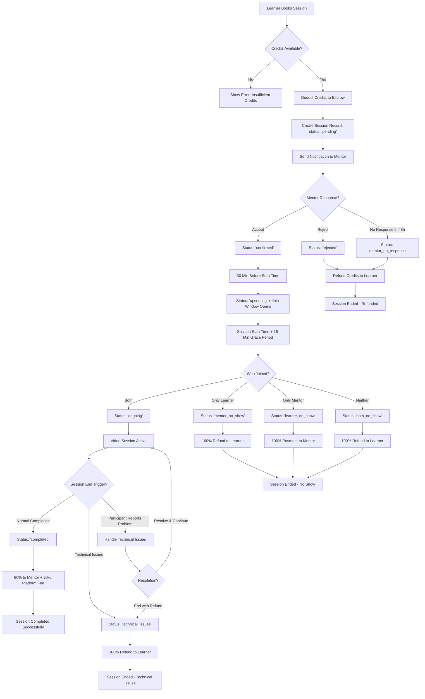
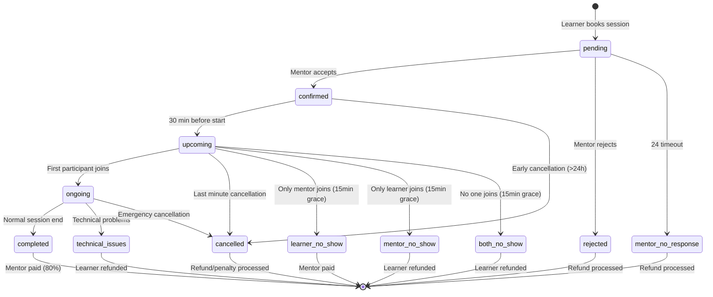
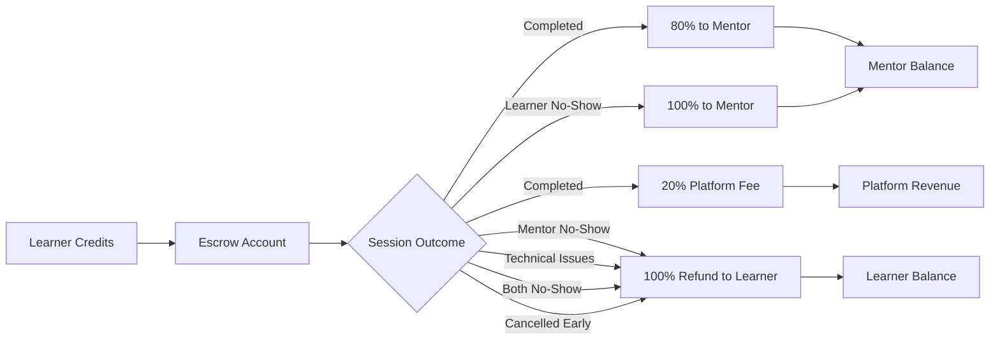
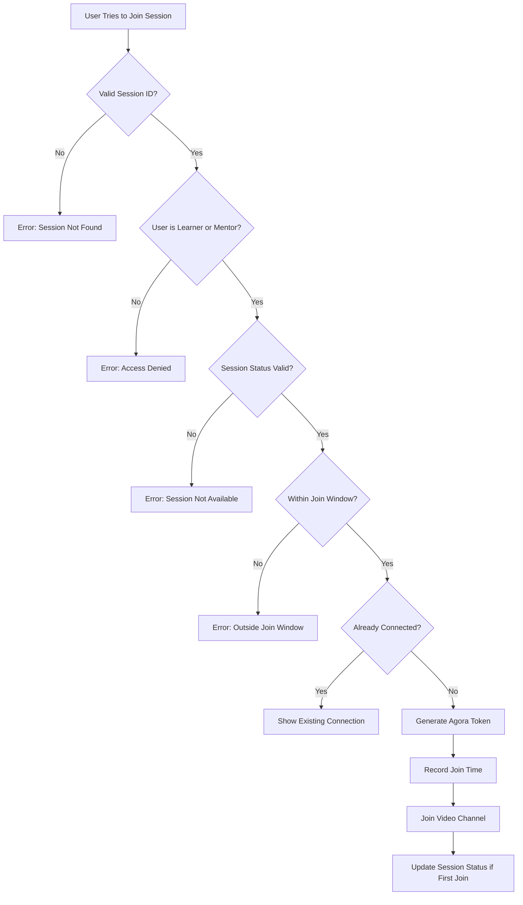
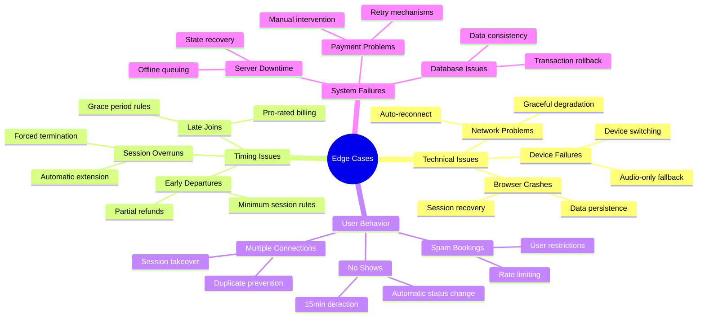
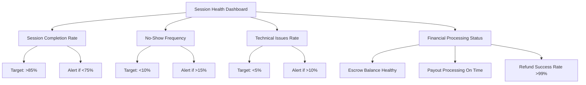

# SkillBridge Session Flow - Visual Guide

## 🎯 Complete Session Journey



## 🔄 Session States in Detail



## 💰 Financial Flow



## 🎥 Video Call Access Control



## 🔧 Edge Cases Handling



## 🚨 Monitoring Dashboard Metrics



---

## 📱 User Experience Flow

### For Learners:

```
1. Browse mentors → 2. Select time slot → 3. Add session notes → 
4. Pay with credits → 5. Wait for mentor confirmation → 
6. Receive notification → 7. Join session 30min early → 
8. Complete session → 9. Rate mentor → 10. Download files attached in the video session
```

### For Mentors:

```
1. Receive booking notification → 2. Review learner profile & notes → 
3. Accept or decline → 4. Prepare for session → 
5. Join when learner arrives → 6. Conduct mentoring → 
7. End session → 8. Receive credits 
```

---

This visual guide complements the comprehensive documentation and makes it easy to understand the complete session management flow, from booking to completion, including all the important edge cases and business rules.